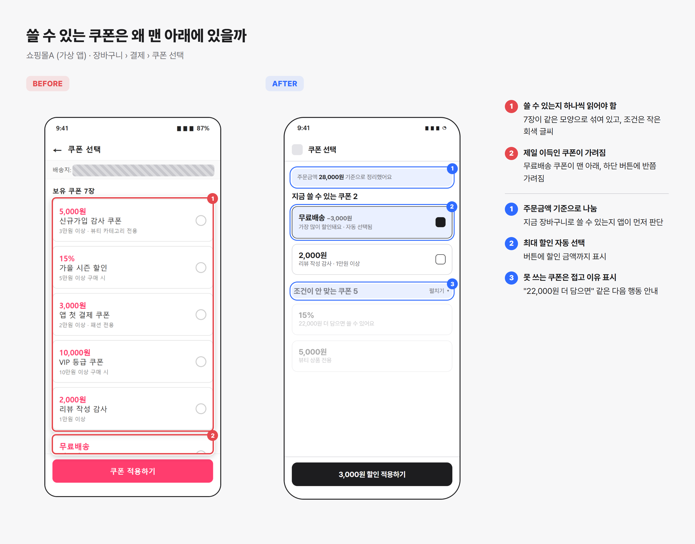
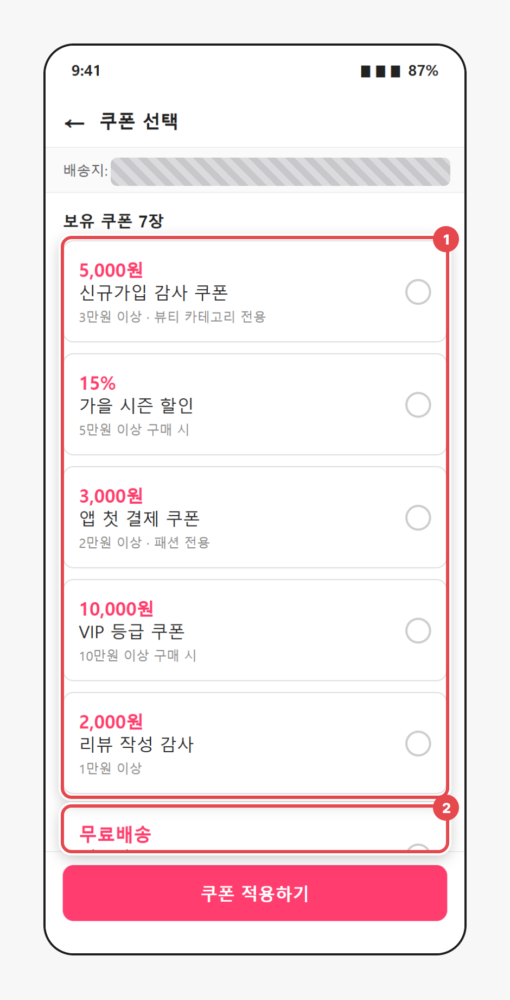
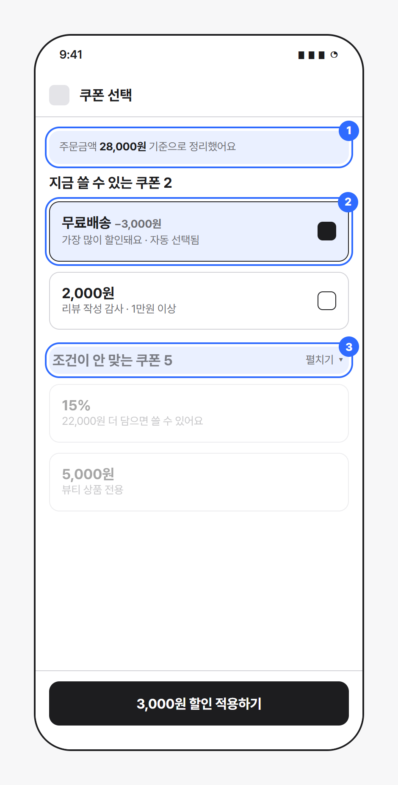

> 📌 파이프라인 시험용 예시 글이에요. 앱과 화면은 가상으로 만들었습니다.

## 하려던 일

28,000원어치 생활용품을 담고, 가장 많이 할인되는 쿠폰을 골라 결제하려고 했어요.

## 무엇이 불편했나

> 쿠폰이 7장인데 실제로 쓸 수 있는 건 2장뿐이었다. 그걸 알려면 쿠폰마다 작은 회색 조건을 하나하나 읽어야 했다. 제일 이득인 무료배송 쿠폰은 맨 아래에 있어서 버튼에 가려져 안 보였다.

## 왜 불편할까

**① 판단을 사용자에게 떠넘겨요.** 화면은 이미 장바구니 금액과 상품 카테고리를 알고 있어요. 그런데도 "3만원 이상", "뷰티 전용" 같은 조건을 사용자가 직접 대조하게 해요. 쓸 수 있는 쿠폰과 쓸 수 없는 쿠폰이 같은 모양이라, 눈으로는 구분이 안 돼요. (닐슨 휴리스틱 6번: 기억보다 알아보기)

**② 가장 중요한 선택지가 가장 안 보이는 곳에 있어요.** 쿠폰이 할인 효과 순이 아니라 발급 순으로 놓여 있어서, 이 주문에서 가장 이득인 무료배송 쿠폰이 맨 아래에 있고 하단 고정 버튼에 반쯤 가려져요.

## 이렇게 바꿔보면

**① 주문금액 기준으로 나눠요.** 맨 위에 "주문금액 28,000원 기준"이라고 밝히고, 지금 쓸 수 있는 쿠폰만 먼저 보여줘요.

**② 가장 이득인 쿠폰을 미리 골라둬요.** 할인액이 가장 큰 쿠폰을 자동으로 선택하고, 버튼에 "3,000원 할인 적용하기"처럼 결과를 보여줘요. 다른 쿠폰으로 바꾸는 것도 한 번에 할 수 있어요.

**③ 못 쓰는 쿠폰은 접고, 이유를 말해줘요.** 조건이 안 맞는 쿠폰은 접어두되, "22,000원 더 담으면 쓸 수 있어요"처럼 다음에 할 수 있는 행동을 알려줘요.

## 고려한 점

- **자동 선택이 오히려 불편할 수 있어요.** 다음 주문을 위해 쿠폰을 아껴두고 싶은 사람도 있어요. 그래서 선택만 해두고, 결제 전에 바꾸거나 빼기 쉽게 했어요.
- **추가 구매 유도가 사라질까?** 발급 순 나열은 "더 담으면 쓸 수 있는 쿠폰"을 보여줘서 추가 구매를 유도하려는 의도일 수도 있어요(추정). ③에서 이유와 남은 금액을 적어 이 장점은 살렸어요.
- 중복 사용이 되는 쿠폰이 있다면 ②의 "가장 이득"은 쿠폰 조합 기준으로 계산해야 해요.

## 한 줄 정리

앱이 이미 아는 정보로 먼저 걸러주면, 사용자는 고르기만 하면 돼요.
