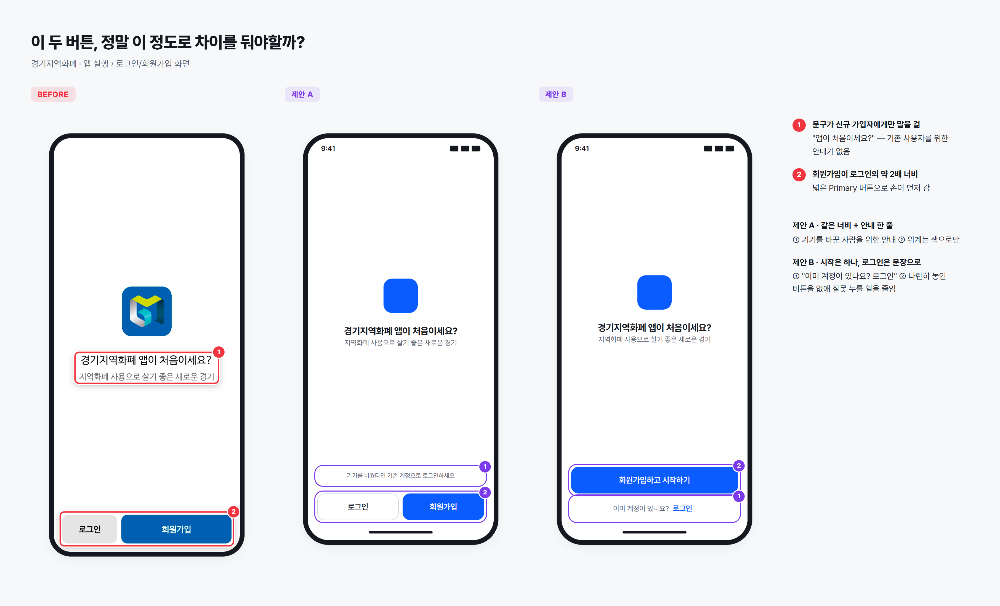
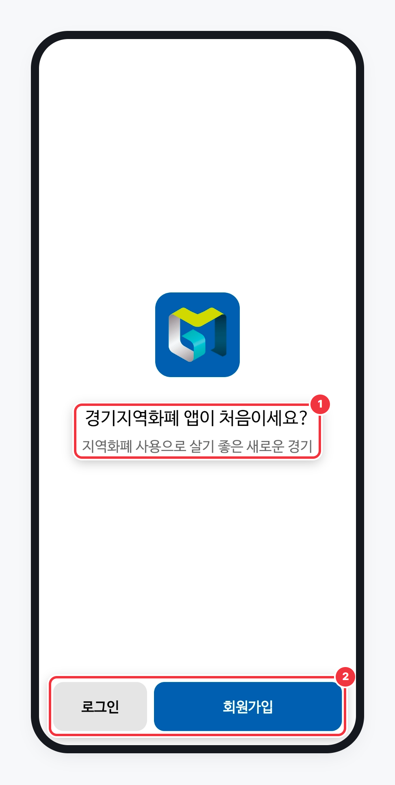
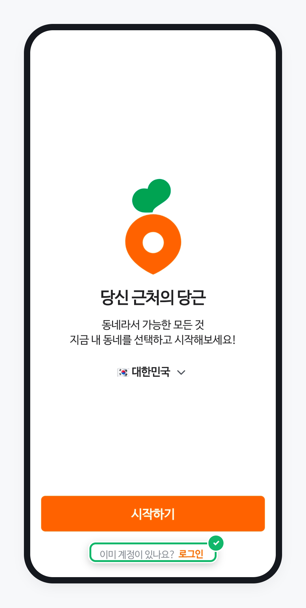
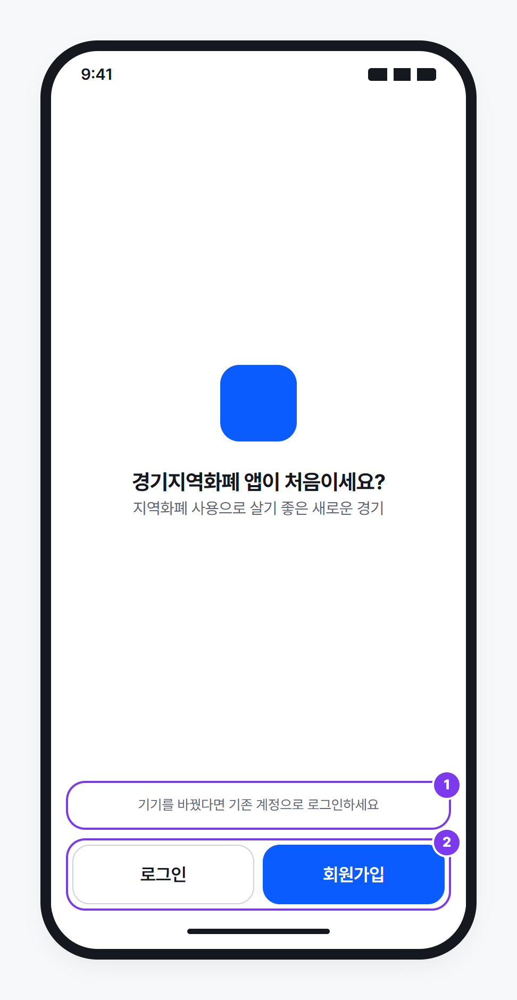
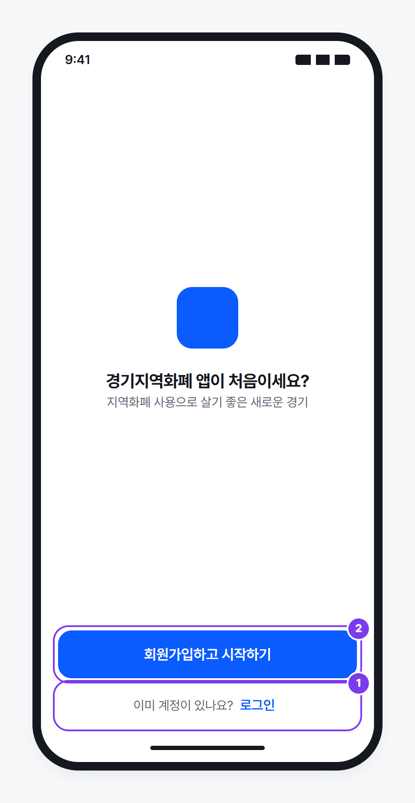

## 하려던 일

휴대폰을 바꿔서 경기지역화폐 앱을 새로 설치했어요. 원래 쓰던 계정으로 로그인하려던 참이었어요.

## 무엇이 불편했나

> 회원가입 버튼 영역이 오른쪽에, 로그인 버튼보다 큰 크기로 되어 있었다. (Primary 컬러 적용) 그래서 로그인을 눌러야 하는데 나도 모르게 회원가입을 눌렀다. 이 어플을 열었을 때 로그인/회원가입 화면을 보는 사용자 중 회원가입 기능이 더 필요한 사용자(=신규 가입자)가 많다면, 두 버튼 사이에 위계를 두는 것에는 동의할 수 있다. 하지만 기기 변경으로 인해 로그인을 하려는 사람 입장에서, 로그인과 회원가입 사이의 위계 차이가 이 정도로 커야한다는 데는 동의하기 힘들었다. 적어도 버튼의 영역 크기가 같았다면, 로그인을 한 번에 보고 누를 수 있었을 것이다.

## 왜 불편할까

**① 문구가 처음 온 사람에게만 말을 걸어요.** 화면에 있는 문장은 "경기지역화폐 앱이 처음이세요?" 하나뿐이에요. 기기를 바꿔 다시 들어온 사람에게는 어디로 가라는 안내가 없어요. 결국 버튼 모양만 보고 판단하게 되고, ②와 겹쳐서 회원가입 쪽으로 손이 가요.

같은 구조인 당근의 첫 화면과 비교해 보면 차이가 분명해요. 당근도 "시작하기" 버튼 하나를 크게 두고 로그인은 작게 둬요. 위계 차이는 오히려 더 커요. 그런데 그 아래에 **"이미 계정이 있나요? 로그인"** 이라고, 기존 사용자를 직접 부르는 문장이 있어요. 그래서 로그인이 작아도 찾는 사람은 바로 찾아요.

**② 위계가 색과 크기, 두 겹으로 걸려 있어요.** 캡처에서 회원가입 버튼은 로그인 버튼보다 2배쯤 넓고, 화면에서 유일하게 진한 색을 써요. 로그인은 연한 회색이에요. 색만 달랐다면 "회원가입이 더 권하는 쪽이구나" 정도로 읽혔을 거예요. 그런데 크기까지 크게 다르면 넓은 버튼이 사실상 "이 화면의 유일한 버튼"처럼 보여요. 게다가 목표물이 클수록 빠르게 누르기 쉬워요(피츠의 법칙: 누르는 데 드는 시간은 목표까지의 거리와 목표의 크기에 따라 달라진다는 원리). 그래서 손이 넓은 쪽으로 먼저 가요. 화면에서 손가락이 가장 많이 머무는 하단 영역의 대부분을 회원가입이 차지하고 있어요.

## 이렇게 바꿔보면

두 가지로 그려봤어요. A는 제보 아이디어(같은 너비)를 그대로 따르고, B는 당근처럼 문장으로 기존 사용자를 불러요.

### 제안 A. 같은 너비 + 안내 한 줄

**① 기존 사용자에게 한 줄 안내를 더해요.** 버튼 바로 위에 "기기를 바꿨다면 기존 계정으로 로그인하세요"라고 적어요. 환영 문구는 그대로 두고, 두 번째 부류의 사용자에게도 갈 곳을 알려줘요.

**② 두 버튼의 너비를 같게 해요.** 로그인과 회원가입을 같은 너비로 나란히 두고, 위계는 색으로만 남겨요. 회원가입은 Primary(채운 버튼), 로그인은 Outline(테두리 버튼)이에요. 신규 가입을 권하는 의도는 지키면서, 로그인도 "같은 크기의 선택지"로 보여요.

### 제안 B. 시작은 하나로, 로그인은 문장으로

**① "이미 계정이 있나요? 로그인"으로 기존 사용자를 직접 불러요.** 로그인을 버튼 모양으로 경쟁시키지 않고, 질문 문장 끝에 붙여요. 기기를 바꾼 사람은 "이미 계정이 있나요?"에서 자기 얘기라는 걸 바로 알아봐요.

**② 회원가입은 꽉 찬 버튼 하나로 둬요.** 비슷한 버튼 두 개가 나란히 붙어 있지 않으니, 옆 버튼을 잘못 누를 일 자체가 줄어요. 버튼 문구도 "회원가입하고 시작하기"로 무엇을 하는 버튼인지 분명히 해요.

### A와 B, 어느 쪽이 나을까

| | 제안 A | 제안 B |
|---|---|---|
| 로그인 찾기 | 같은 크기 버튼으로 바로 보임 | 문장을 읽어야 보이지만, 자기 얘기라 금방 찾음 |
| 잘못 누를 위험 | 줄지만 두 버튼은 여전히 나란히 있음 | 비슷한 버튼이 나란히 있지 않아 더 적음 |
| 신규 가입 유도 | 색으로만 | 큰 버튼 하나로 더 강하게 |
| 바꾸는 범위 | 버튼 너비 + 문구 한 줄 | 버튼 구성 자체를 바꿈 |

## 고려한 점

- **신규 가입이 줄어들까?** 회원가입 버튼을 크게 만든 건 첫 화면에서 가입을 늘리려는 의도였을 수 있어요(추정). A는 색 위계를 그대로 두어서, B는 큰 버튼을 회원가입에 남겨서, 둘 다 권하는 쪽은 여전히 회원가입이에요.
- **B는 로그인 영역이 작아져요.** 글자만 누르게 하면 손가락으로 맞히기 어려워요. 문장 전체 줄을 누를 수 있게 하거나, 로그인 글자 주변으로 최소 48dp 높이의 누를 영역을 확보해야 해요.
- **B는 제보 아이디어와 방향이 달라요.** 제보는 "버튼 크기를 같게"였고, B는 크기 차이를 오히려 키우는 대신 문장으로 길을 알려줘요. 어느 쪽이 맞는지는 이 화면을 보는 사람 중 기존 사용자가 얼마나 되는지에 따라 달라요.
- **버튼 순서는 바꾸지 않았어요(A).** 로그인을 오른쪽으로 옮기는 방법도 있지만, 이미 이 배치에 익숙한 사용자가 오히려 헷갈릴 수 있어요.

## 한 줄 정리

기존 사용자를 말로 불러주거나, 누를 수 있는 크기를 똑같이 나눠주세요. 둘 중 하나만 있어도 로그인을 잘못 누를 일은 줄어요.
